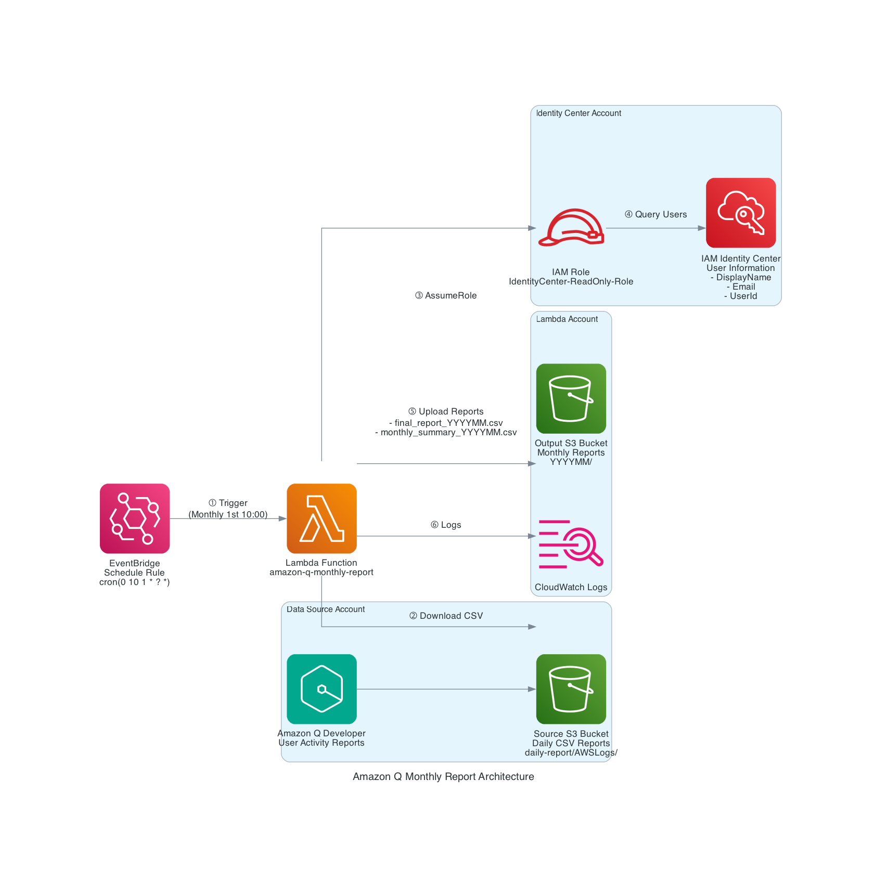

# Amazon Q Developer 월별 사용량 리포트 자동화 (Lambda + EventBridge)

S3에 저장된 Amazon Q Developer 일별 사용량 데이터를 Lambda로 자동 처리하여 매월 1일 오전 10시에 월별 리포트를 생성하는 배치 시스템입니다.

> **💡 누구를 위한 솔루션인가요?**  
> 이 솔루션은 **AWS Organizations에서 Amazon Q Developer를 사용하는 조직**을 위해 설계되었습니다. 다양한 계정 구성을 지원합니다:
> - **단일 계정**: IAM Identity Center, Amazon Q, S3가 같은 계정에 있는 경우
> - **멀티 계정**: IAM Identity Center는 Management Account, Amazon Q와 S3는 멤버 계정



## 📋 목차

- [아키텍처](#아키텍처)
- [기능](#기능)
- [사전 요구사항](#사전-요구사항)
- [설치 및 배포](#설치-및-배포)
- [설정](#설정)
- [사용 방법](#사용-방법)
- [출력 파일](#출력-파일)
- [문제 해결](#문제-해결)

## 🏗️ 아키텍처

```
┌─────────────────────────────────────────────────────────────────────────────┐
│                         AWS 계정 (Lambda 실행)                               │
│                                                                              │
│  ┌──────────────────┐                                                       │
│  │  EventBridge     │                                                       │
│  │  스케줄 규칙      │                                                       │
│  │                  │                                                       │
│  │ cron(0 10 1 * ?) │  트리거 (매월 1일 오전 10시)                          │
│  └────────┬─────────┘                                                       │
│           │                                                                  │
│           ▼                                                                  │
│  ┌──────────────────────────────────────────────────────────────┐          │
│  │           Lambda 함수                                         │          │
│  │     amazon-q-monthly-report                                  │          │
│  │                                                               │          │
│  │  환경변수:                                                    │          │
│  │  - IDENTITY_PROFILE_ACCOUNT_ID                              │          │
│  │  - IDENTITY_ACCOUNT_ROLE_NAME                               │          │
│  │  - S3_BUCKET, S3_BUCKET_REGION                              │          │
│  │  - IDENTITY_REGION, OUTPUT_BUCKET                           │          │
│  └───┬──────────────────────────┬──────────────────────────┬───┘          │
│      │                          │                          │               │
│      │ ① CSV 다운로드           │ ② 사용자 정보 조회       │ ③ 리포트      │
│      │                          │   (AssumeRole)          │   업로드      │
└──────┼──────────────────────────┼──────────────────────────┼───────────────┘
       │                          │                          │
       │                          │                          │
       ▼                          ▼                          ▼
┌──────────────────────┐  ┌──────────────────────┐  ┌──────────────────────┐
│  AWS 계정            │  │  AWS 계정            │  │  AWS 계정            │
│  (데이터 소스)       │  │  (Identity Center)   │  │  (Lambda)            │
│                      │  │                      │  │                      │
│  ┌────────────────┐ │  │  ┌────────────────┐ │  │  ┌────────────────┐ │
│  │  S3 버킷       │ │  │  │ Identity Center│ │  │  │  S3 버킷       │ │
│  │                │ │  │  │                │ │  │  │                │ │
│  │  소스 CSV      │ │  │  │  사용자 정보    │ │  │  │  결과 리포트   │ │
│  │  파일          │ │  │  │  - DisplayName │ │  │  │                │ │
│  │                │ │  │  │  - Email       │ │  │  │                │ │
│  │  구조:         │ │  │  │  - UserId      │ │  │  │  구조:         │ │
│  │  daily-report/ │ │  │  └────────────────┘ │  │  │  YYYYMM/       │ │
│  │    └─AWSLogs/  │ │  │                      │  │  │    ├─final_    │ │
│  │      └─{acct}/ │ │  │  IAM Role:           │  │  │    │  report_  │ │
│  │        └─Kiro/ │ │  │  IdentityCenter-     │  │  │    │  YYYYMM   │ │
│  │          QDev/ │ │  │  ReadOnly-Role       │  │  │    │  .csv     │ │
│  │          Logs/ │ │  │                      │  │  │    └─monthly_  │ │
│  │          └─by_ │ │  │  권한:               │  │  │       summary_ │ │
│  │            user│ │  │  - ListUsers         │  │  │       YYYYMM   │ │
│  │            _ana│ │  │  - ListInstances     │  │  │       .csv     │ │
│  │            lyt/│ │  │                      │  │  └────────────────┘ │
│                      │  │                      │  │                      │
└──────────────────────┘  └──────────────────────┘  │  권한:               │
                                                     │  - s3:PutObject      │
                                                     │                      │
                                                     └──────────────────────┘
```

**처리 흐름:**
1. EventBridge가 매월 1일 오전 10시에 Lambda 트리거
2. Lambda가 이전 달 계산 (YYYY-MM)
3. Lambda가 소스 S3에서 CSV 파일 다운로드 (같은 계정, AssumeRole 불필요)
4. Lambda가 Identity Center 계정의 Role을 Assume하여 사용자 정보 조회
5. Lambda가 CSV 데이터와 사용자 정보 병합 (DisplayName, Email)
6. Lambda가 두 개의 리포트 생성:
   - `final_report_YYYYMM.csv` (일별 상세 데이터)
   - `monthly_summary_YYYYMM.csv` (월별 합산 데이터)
7. Lambda가 Output S3의 YYYYMM/ 폴더에 리포트 업로드
8. 처리 완료, CloudWatch에 로그 기록

## 🎯 기능

1. **자동 스케줄링**: EventBridge로 매월 1일 오전 10시 자동 실행
2. **Cross-Account Access**: AssumeRole을 통한 다른 계정 리소스 접근
3. **자동 연월 계산**: 실행 시점 기준 이전 달 자동 계산
4. **S3 폴더 구조**: 연월별 폴더 자동 생성 (예: `202501/`)
5. **CSV 병합 및 보강**: Identity Store 정보 자동 매핑
6. **월별 합산 리포트**: 사용자별 월간 사용량 자동 집계

## 📦 사전 요구사항

### Amazon Q Developer 설정

**이 솔루션을 사용하기 전에 반드시 완료해야 할 사항:**

1. **Amazon Q Developer에서 사용자 활동 리포트 활성화**
   - Amazon Q Developer 콘솔로 이동
   - "User Activity Reports" 기능 활성화
   - 리포트 저장용 S3 버킷 설정

2. **S3 버킷 구성**
   - S3 버킷에 `daily-report/` 접두사가 설정되어 있어야 함
   - Amazon Q가 자동으로 다음 구조를 생성합니다:
     ```
     s3://your-bucket/
       └── daily-report/
           └── AWSLogs/
               └── {account-id}/
                   └── KiroLogs|QDeveloperLogs/
                       └── by_user_analytic/
                           └── {region}/
                               └── {year}/
                                   └── {month}/
                                       └── {day}/
                                           └── {hour}/
                                               └── {account-id}_by_user_analytic_{timestamp}_report.csv
     ```
   - **중요**: 솔루션 코드는 `daily-report/` 접두사를 기대합니다

3. **IAM Identity Center**
   - AWS Organization의 Management Account(Payer)에서 활성화되든, Member Account에서 활성화되든 Config에서 계정정보와 리전을 잘 명시하면 됨
   - Amazon Q에서 사용자는 user-id값으로 로깅을 하는데, 이 정보는 IAM Identity Center를 통해 API로 질의해야만 알 수 있는 정보임

### 필수 소프트웨어
- AWS CLI 설정 완료
- Python 3.11 이상
- jq (JSON 파싱용)
- bash

### AWS 권한

#### Lambda 실행 Role
- `sts:AssumeRole` - 다른 계정 Role Assume
- `s3:PutObject` - 결과 S3 업로드
- `logs:CreateLogGroup`, `logs:CreateLogStream`, `logs:PutLogEvents` - CloudWatch Logs

#### S3 접근 Role (Target Account)
- `s3:GetObject`, `s3:ListBucket` - CSV 다운로드

#### Identity Store 접근 Role (Target Account)
- `identitystore:ListUsers`
- `sso-admin:ListInstances`

**Trust Policy 설정:**

Identity Center 계정의 Role은 Lambda 실행 Role을 신뢰해야 합니다. 다음 중 하나의 방법으로 설정:
- **배포 전**: 수동으로 Trust Relationship 추가
- **배포 후**: Lambda Role ARN으로 Trust Policy 업데이트

**`IdentityCenter-ReadOnly-Role` Trust Policy 예시:**
```json
{
  "Version": "2012-10-17",
  "Statement": [
    {
      "Effect": "Allow",
      "Principal": {
        "AWS": "arn:aws:iam::LAMBDA_ACCOUNT_ID:role/AmazonQMonthlyReportLambdaRole"
      },
      "Action": "sts:AssumeRole",
      "Condition": {
        "StringEquals": {
          "sts:ExternalId": "your-external-id"
        }
      }
    }
  ]
}
```

변경 필요 항목:
- `LAMBDA_ACCOUNT_ID`: Lambda가 배포된 AWS 계정 ID
- `your-external-id`: 추가 보안을 위한 External ID (선택사항, `config.json`과 일치해야 함)

## 🔧 설치 및 배포

### 1. 설정 파일 생성

```bash
cd /Users/jogilsang/Documents/project/amazon_q_montly_usage_report_with_script_for_batch

# config.json.example을 복사하여 config.json 생성
cp config.json.example config.json

# config.json 편집
vi config.json
```

**config.json 예시:**
```json
{
  "lambda_name": "amazon-q-monthly-report",
  "lambda_role_name": "AmazonQMonthlyReportLambdaRole",
  "lambda_region": "us-east-1",
  "eventbridge_region": "us-east-1",
  "identity_profile": {
    "account_id": "123456789012",
    "account_role_name": "IdentityCenter-ReadOnly-Role",
    "external_id": ""
  },
  "s3_bucket": "q-userreport-managementaccount-us",
  "s3_bucket_region": "us-east-1",
  "identity_region": "ap-northeast-2",
  "output_bucket": "your-output-bucket-name",
  "eventbridge_rule_name": "amazon-q-monthly-report-schedule",
  "schedule": "cron(0 10 1 * ? *)"
}
```

### 2. 전체 배포 (권장)

```bash
./deploy.sh all
```

이 명령어는 다음을 자동으로 수행합니다:
1. Lambda 패키징 (의존성 포함)
2. IAM Role 생성 (AssumeRole 권한 포함)
3. Lambda 함수 생성
4. EventBridge Rule 생성 및 연결

### 3. 개별 배포

필요한 리소스만 배포할 수 있습니다:

```bash
# Lambda 함수만 배포
./deploy.sh lambda

# IAM Role만 생성
./deploy.sh role

# EventBridge Rule만 생성
./deploy.sh eventbridge

# Lambda 코드만 업데이트
./deploy.sh update-lambda
```

## 설정

### config.json 파라미터 설명

| 파라미터 | 설명 | 예시 |
|---------|------|------|
| `lambda_name` | Lambda 함수 이름 | `amazon-q-monthly-report` |
| `lambda_role_name` | Lambda 실행 Role 이름 | `AmazonQMonthlyReportLambdaRole` |
| `s3_profile.account_id` | S3 접근 대상 계정 ID | `123456789012` |
| `s3_profile.role_name` | S3 접근용 Role 이름 | `IdentityCenter-ReadOnly-Role` |
| `identity_profile.account_id` | Identity Store 계정 ID | `987654321012` |
| `identity_profile.role_name` | Identity Store 접근용 Role 이름 | `IdentityCenter-ReadOnly-Role` |
| `s3_bucket` | 소스 S3 버킷 (Q 일별 사용량 레포트 CSV 위치) | `q-userreport-managementaccount-us` |
| `s3_bucket_region` | 소스 S3 버킷 리전 | `us-east-1` |
| `identity_region` | Identity Store 리전 | `ap-northeast-2` |
| `output_bucket` | 결과 저장 S3 버킷 (Q 월별 사용량 레포트 저장할 곳) | `my-reports-bucket` |
| `eventbridge_rule_name` | EventBridge Rule 이름 | `amazon-q-monthly-report-schedule` |
| `schedule` | 실행 스케줄 (cron) | `cron(0 10 1 * ? *)` |

### 스케줄 설정

EventBridge cron 표현식 형식: `cron(분 시 일 월 요일 년)`

**예시:**
- `cron(0 10 1 * ? *)` - 매월 1일 오전 10시
- `cron(0 9 1 * ? *)` - 매월 1일 오전 9시
- `cron(0 14 1 * ? *)` - 매월 1일 오후 2시

## 사용 방법

### 자동 실행

배포 후 EventBridge가 자동으로 매월 1일 오전 10시에 Lambda를 실행합니다.

### 수동 실행 (테스트)

```bash
# AWS CLI로 Lambda 직접 실행
aws lambda invoke \
  --function-name amazon-q-monthly-report \
  --payload '{}' \
  response.json

# 결과 확인
cat response.json
```

### 로그 확인

```bash
# CloudWatch Logs 확인
aws logs tail /aws/lambda/amazon-q-monthly-report --follow
```

## 📊 출력 파일

Lambda 실행 후 Output S3 버킷에 다음 구조로 파일이 생성됩니다:

```
your-output-bucket/
└── 202501/                              # 연월 폴더
    ├── final_report_202501.csv          # 일별 상세 리포트
    └── monthly_summary_202501.csv       # 월별 합산 리포트
```

### 파일 설명

#### 1. `final_report_YYYYMM.csv`
- **내용**: 일별 상세 사용량 데이터
- **컬럼**: DisplayName, UserName, Email, UserId, 기타 메트릭
- **인코딩**: UTF-8 BOM (Excel 한글 호환)

#### 2. `monthly_summary_YYYYMM.csv`
- **내용**: 사용자별 월간 합산 데이터
- **컬럼**: DisplayName, UserName, Email, UserId, 합산 메트릭
- **인코딩**: UTF-8 BOM (Excel 한글 호환)

## 🔍 Lambda 실행 흐름

```
1. EventBridge 트리거 (매월 1일 10:00)
   ↓
2. 이전 달 계산 (예: 2025-01)
   ↓
3. S3 Role Assume
   ↓
4. CSV 다운로드 및 병합
   ↓
5. Identity Store Role Assume
   ↓
6. 사용자 정보 조회
   ↓
7. CSV 보강 (DisplayName, Email 추가)
   ↓
8. 월별 합산 리포트 생성
   ↓
9. Output S3에 업로드
   ↓
10. 완료 (CloudWatch Logs 기록)
```

## 🐛 문제 해결

### 1. `config.json 파일이 없습니다`

**원인**: 설정 파일 미생성

**해결**:
```bash
cp config.json.example config.json
vi config.json  # 설정 편집
```

### 2. `AccessDenied` 에러

**원인**: AssumeRole 권한 부족

**해결**:
1. Target Account의 Role Trust Policy 확인
2. Lambda Role에 `sts:AssumeRole` 권한 확인

**Target Account Role Trust Policy 예시:**
```json
{
  "Version": "2012-10-17",
  "Statement": [
    {
      "Effect": "Allow",
      "Principal": {
        "AWS": "arn:aws:iam::LAMBDA_ACCOUNT_ID:role/AmazonQMonthlyReportLambdaRole"
      },
      "Action": "sts:AssumeRole"
    }
  ]
}
```

### 3. Lambda Timeout

**원인**: 처리 시간 초과 (기본 15분)

**해결**:
```bash
# Timeout 증가 (최대 15분)
aws lambda update-function-configuration \
  --function-name amazon-q-monthly-report \
  --timeout 900
```

### 4. `No data found for YYYYMM`

**원인**: 해당 연월의 CSV 파일 없음

**해결**:
- S3 버킷 경로 확인
- 연월 폴더 구조 확인: `daily-report/.../YYYY/MM/`

### 5. EventBridge Rule이 실행되지 않음

**원인**: Lambda 권한 누락

**해결**:
```bash
# Lambda에 EventBridge 권한 추가
aws lambda add-permission \
  --function-name amazon-q-monthly-report \
  --statement-id AllowEventBridgeInvoke \
  --action lambda:InvokeFunction \
  --principal events.amazonaws.com \
  --source-arn "arn:aws:events:REGION:ACCOUNT_ID:rule/amazon-q-monthly-report-schedule"
```

## 🗑️ 리소스 삭제

모든 리소스를 삭제하려면:

```bash
./deploy.sh delete
```

이 명령어는 다음을 삭제합니다:
- EventBridge Rule
- Lambda Function
- IAM Role 및 Policy
- 임시 파일 (package/, lambda_function.zip)

**주의**: Output S3 버킷의 파일은 삭제되지 않습니다.

## 참고사항

### Lambda 환경변수

Lambda 함수는 다음 환경변수를 사용합니다:

| 환경변수 | 설명 |
|---------|------|
| `S3_PROFILE_ACCOUNT_ID` | S3 접근 계정 ID |
| `S3_PROFILE_ROLE_NAME` | S3 접근 Role 이름 |
| `IDENTITY_PROFILE_ACCOUNT_ID` | Identity Store 계정 ID |
| `IDENTITY_PROFILE_ROLE_NAME` | Identity Store Role 이름 |
| `S3_BUCKET` | 소스 S3 버킷 |
| `S3_BUCKET_REGION` | 소스 S3 리전 |
| `IDENTITY_REGION` | Identity Store 리전 |
| `OUTPUT_BUCKET` | 결과 저장 버킷 |

### 비용 고려사항

- **Lambda**: 실행 시간 기준 과금 (월 1회 실행)
- **EventBridge**: Rule 생성 무료, 실행 횟수 기준 과금
- **S3**: 저장 용량 및 요청 횟수 기준 과금
- **CloudWatch Logs**: 로그 저장 용량 기준 과금

**예상 비용**: 월 $1 미만 (소규모 사용 기준)

## 지원

문제가 발생하거나 개선 사항이 있으면 이슈를 생성해주세요.

---

**버전**: v1.0  
**최종 업데이트**: 2026-03-20
